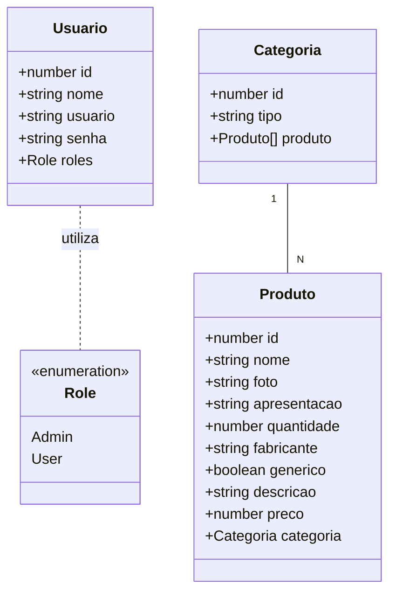
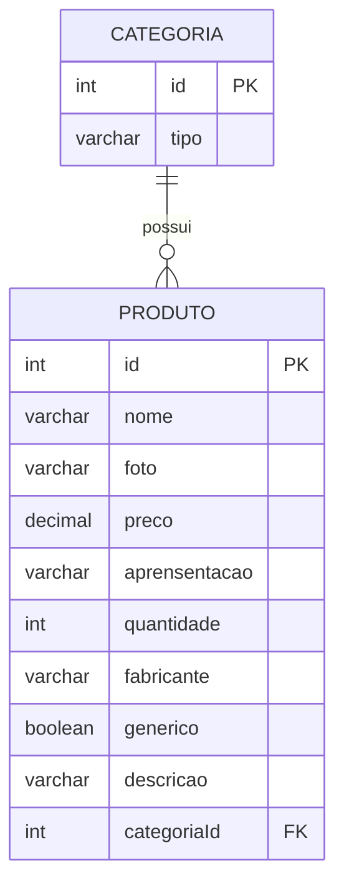

# Farmácia da Gente

----------------

<p align="center">
  <svg height="200px" width="200px" version="1.1" id="Layer_1" xmlns="http://www.w3.org/2000/svg" xmlns:xlink="http://www.w3.org/1999/xlink" viewBox="0 0 512.008 512.008" xml:space="preserve" fill="#000000"><g id="SVGRepo_bgCarrier" stroke-width="0"></g><g id="SVGRepo_tracerCarrier" stroke-linecap="round" stroke-linejoin="round"></g><g id="SVGRepo_iconCarrier"> <path style="fill:#CCD1D9;" d="M11.695,490.178c0,11.757,9.543,21.3,21.3,21.3h457.713c11.757,0,21.3-9.543,21.3-21.3V43.099 c0-11.757-9.543-21.284-21.3-21.284H32.995c-11.757,0-21.3,9.527-21.3,21.284C11.695,43.099,11.695,490.178,11.695,490.178z"></path> <g> <path style="fill:#434A54;" d="M10.65,64.399C4.771,64.399,0,69.155,0,75.034v85.168c0,5.879,4.771,10.635,10.65,10.635 c5.878,0,10.649-4.756,10.649-10.635V75.033C21.3,69.154,16.529,64.399,10.65,64.399z"></path> <path style="fill:#434A54;" d="M10.65,319.872c-5.879,0-10.65,4.756-10.65,10.635v85.168c0,5.879,4.771,10.635,10.65,10.635 c5.878,0,10.649-4.756,10.649-10.635v-85.168C21.3,324.628,16.529,319.872,10.65,319.872z"></path> </g> <path style="fill:#E6E9ED;" d="M11.695,468.894c0,11.757,9.543,21.284,21.3,21.284h457.713c11.757,0,21.3-9.527,21.3-21.284V21.815 c0-11.757-9.543-21.284-21.3-21.284H32.995c-11.757,0-21.3,9.527-21.3,21.284C11.695,21.815,11.695,468.894,11.695,468.894z"></path> <path style="fill:#434A54;" d="M447.079,245.354c0,5.878,4.771,10.65,10.649,10.65c5.879,0,10.65-4.771,10.65-10.65 s-4.771-10.65-10.65-10.65C451.851,234.704,447.079,239.476,447.079,245.354z"></path> <path style="fill:#DA4453;" d="M149.037,298.573c-11.71,0-21.3-9.574-21.3-21.285V213.42c0-11.71,9.589-21.284,21.3-21.284h234.174 c11.726,0,21.3,9.574,21.3,21.284v63.868c0,11.711-9.574,21.285-21.3,21.285H149.037z"></path> <path style="fill:#ED5564;" d="M319.342,362.441c0,11.711-9.573,21.301-21.283,21.301H234.19c-11.71,0-21.284-9.59-21.284-21.301 V128.267c0-11.71,9.574-21.3,21.284-21.3h63.869c11.71,0,21.283,9.589,21.283,21.3V362.441z"></path> </g></svg>
</p>

<div align="center">
  
  
  
  
</div>


## 1. Descrição

Este projeto é uma aplicação **backend** desenvolvida como projeto final do segundo bloco do bootcamp da Generation Brasil. O sistema consiste em uma plataforma de **e-commerce de farmácia**. 

------

## 2. Sobre esta API

A API foi construída seguindo os princípios da arquitetura REST com **NestJS**, focando em performance, tipagem forte com TypeScript e manutenibilidade. Ela funciona como o core de um e-commerce farmacêutico, lidando com o CRUD completo de produtos e suas respectivas categorias.

### 2.1. Principais Funcionalidades

1.   📂 **Gerenciamento de Categorias**: Criação, listagem, atualização e exclusão de categorias.
2.  🛒 **Controle de Produtos**: Cadastro detalhado de itens com nome, preço, foto e descrição. 
3.  🔗 **Relacionamento entre Tabelas**: Vinculação entre produtos e categorias (relação many-to-one).
5.  🔍 **Busca Avançada**: Endpoints customizados para busca de produtos por nome e preço. 
6.  🔑 **Autenticação**: Implementação de login e proteção de rotas, garantindo que apenas usuários autenticados acessem os recursos da API. 
7.  🔐 **Controle de Acesso (RBAC)**: Sistema de permissões baseado em funções (Roles), distinguindo usuários comuns de administradores. 
------

## 3. Diagrama de Classes

O diagrama abaixo ilustra a estrutura das classes e como os serviços se comunicam dentro do ecossistema NestJS.



------

## 4. Diagrama Entidade-Relacionamento (DER)

O banco de dados foi modelado para garantir integridade referencial entre os produtos e suas categorias.




------

## 5. Tecnologias utilizadas

| Item                          | Descrição               |
| ----------------------------- | ----------------------- |
| 🖥️ **Servidor** | Node.js            |
| ⌨️ **Linguagem de programação** | TypeScript              |
| 🧩 **Framework** | NestJS                 |
| 🌉 **ORM** | TypeORM                 |
| 🛢️ **Banco de dados** | MySQL     |
| 🛂 **Autenticação e Segurança**	| Passport JWT & Bcrypt |
| 📖 **Documentação** | Swagger (OpenAPI)       |


------

## 6. Configuração e Execução

Para rodar este projeto localmente, siga os passos abaixo:

1. **📥** **Clone o repositório:**

   ```bash
   git clone https://github.com/dashenio/projeto_final_bloco_02.git
   ```

2. **📦 Instale as dependências:**

   ```bash
   npm install
   ```

3. **🛢️ Configure o banco de dados:**
   Abra o arquivo `src/app.module.ts` e insira suas credenciais do banco de dados local.

4. **Execute a aplicação:**

   ```bash
   npm run start:dev
   ```

5. **Acesse a documentação:**
   Acesse http://localhost:4000 para visualizar e testar os endpoints.


---
Desenvolvido por **Vivian Rodrigues** durante o Bootcamp da **Generation Brasil** 🚀

