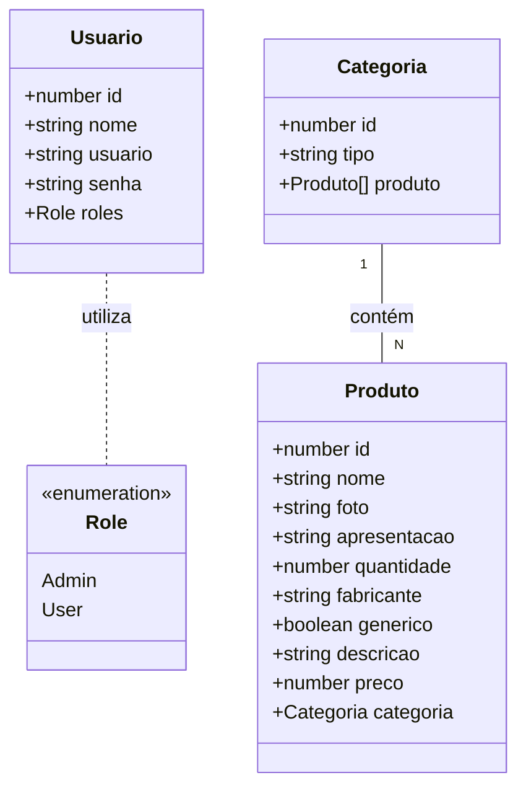
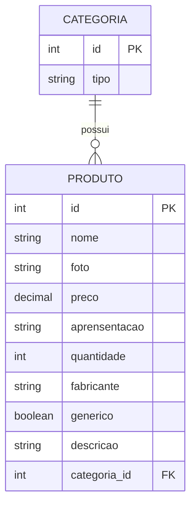

# Projeto Final Bloco 02 - Farmácia da Gente 💊

<br />

<p align="center">
  <a href="http://nestjs.com/" target="blank"></a>
</p>


## 1. 📝 Descrição

Este projeto é uma aplicação **Backend** desenvolvida como projeto final do segundo bloco do bootcamp da Generation Brasil. O sistema consiste em uma plataforma de **e-commerce de Farmácia**. 

------

## 2. ⚙️ Sobre esta API

A API foi construída seguindo os princípios da arquitetura de microserviços com **NestJS**, focando em alta performance, tipagem forte com TypeScript e manutenibilidade. Ela funciona como o core de um e-commerce farmacêutico, lidando com o CRUD completo de produtos e suas respectivas categorias.

### 2.1. Principais Funcionalidades

1.  **Gerenciamento de Categorias**: Criação, listagem, atualização e exclusão de categorias (ex: Medicamentos, Higiene, Cosméticos). 📂
2.  **Controle de Produtos**: Cadastro detalhado de itens com nome, preço, foto e descrição. 🛒
3.  **Relacionamento entre Tabelas**: Vinculação inteligente entre produtos e categorias (Many-to-One). 🔗
4.  **Validação de Dados**: Uso de `class-validator` para garantir que apenas dados aceitáveis entrem no sistema. ✅
5.  **Busca Avançada**: Endpoints customizados para busca de produtos por nome e preço (menor que/maior que). 🔍
6.  ****
------

## 3. 📊 Diagrama de Classes

O diagrama abaixo ilustra a estrutura das classes e como os serviços se comunicam dentro do ecossistema NestJS.



------

## 4. 🗄️ Diagrama Entidade-Relacionamento (DER)

O banco de dados foi modelado para garantir integridade referencial entre os produtos e suas categorias.




</div>

------

## 5. 🚀 Tecnologias utilizadas

| Item                          | Descrição               |
| ----------------------------- | ----------------------- |
| **Servidor** | Node JS                 |
| **Linguagem de programação** | TypeScript              |
| **Framework** | Nest JS                 |
| **ORM** | TypeORM                 |
| **Banco de dados** | MySQL     |
| **Validação** | Class-Validator         |


------

## 6. 🛠️ Configuração e Execução

Para rodar este projeto localmente, siga os passos abaixo:

1.  **Clone o repositório:**
    ```bash
    git clone [https://github.com/dashenio/projeto_final_bloco_02.git](https://github.com/dashenio/projeto_final_bloco_02.git)
    ```
2.  **Instale as dependências:**
    ```bash
    npm install
    ```
3.  **Configure o banco de dados:**
    Abra o arquivo `src/app.module.ts` e insira suas credenciais do banco de dados local.

4.  **Execute as migrações (se necessário) e inicie a aplicação:**
    ```bash
    npm run start:dev
    ```
5.  **Acesse a documentação:**
    Acesse `http://localhost:4000/swagger` para visualizar e testar os endpoints.


---
Desenvolvido durante o curso da **Generation Brasil** 🚀