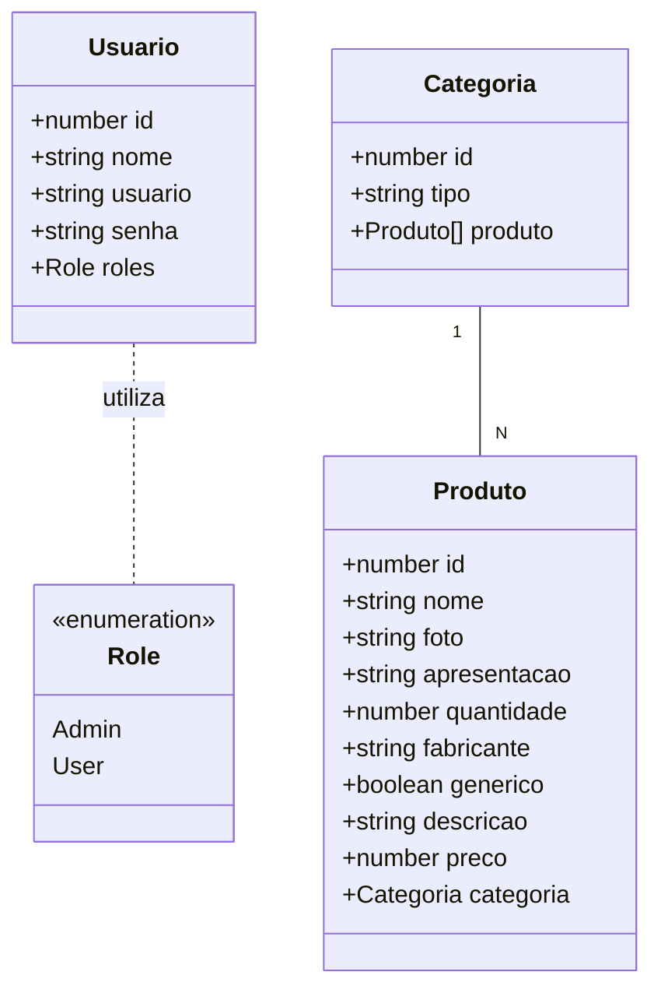
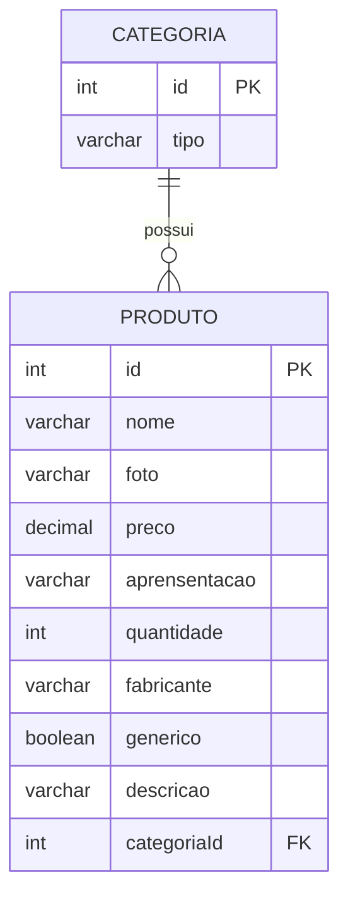

# Farmácia da Gente

<p align="center">
  
</p>

<div align="center">
  
  
  
  
</div>


## 1. Descrição

Este projeto é uma aplicação **backend** desenvolvida como projeto final do segundo bloco do bootcamp da Generation Brasil. O sistema consiste em uma plataforma de **e-commerce de farmácia**. 

------

## 2. Sobre esta API

A API foi construída seguindo os princípios da arquitetura REST com **NestJS**, focando em performance, tipagem forte com TypeScript e manutenibilidade. Ela funciona como o core de um e-commerce farmacêutico, lidando com o CRUD completo de produtos e suas respectivas categorias.

### 2.1. Principais Funcionalidades

1.   📂 **Gerenciamento de Categorias**: Criação, listagem, atualização e exclusão de categorias.
2.  🛒 **Controle de Produtos**: Cadastro detalhado de itens com nome, preço, foto e descrição. 
3.  🔗 **Relacionamento entre Tabelas**: Vinculação entre produtos e categorias (relação many-to-one).
5.  🔍 **Busca Avançada**: Endpoints customizados para busca de produtos por nome e preço. 
6.  🔑 **Autenticação**: Implementação de login e proteção de rotas, garantindo que apenas usuários autenticados acessem os recursos da API. 
7.  🔐 **Controle de Acesso (RBAC)**: Sistema de permissões baseado em funções (Roles), distinguindo usuários comuns de administradores. 
------

## 3. Diagrama de Classes

O diagrama abaixo ilustra a estrutura das classes e como os serviços se comunicam dentro do ecossistema NestJS.



------

## 4. Diagrama Entidade-Relacionamento (DER)

O banco de dados foi modelado para garantir integridade referencial entre os produtos e suas categorias.




------

## 5. Tecnologias utilizadas

| Item                          | Descrição               |
| ----------------------------- | ----------------------- |
| 🖥️ **Servidor** | Node.js            |
| ⌨️ **Linguagem de programação** | TypeScript              |
| 🧩 **Framework** | NestJS                 |
| 🌉 **ORM** | TypeORM                 |
| 🛢️ **Banco de dados** | MySQL     |
| 🛂 **Autenticação e Segurança**	| Passport JWT & Bcrypt |
| 📖 **Documentação** | Swagger (OpenAPI)       |


------

## 6. Configuração e Execução

Para rodar este projeto localmente, siga os passos abaixo:

1. **📥** **Clone o repositório:**

   ```bash
   git clone https://github.com/dashenio/projeto_final_bloco_02.git
   ```

2. **📦 Instale as dependências:**

   ```bash
   npm install
   ```

3. **🛢️ Configure o banco de dados:**
   Abra o arquivo `src/app.module.ts` e insira suas credenciais do banco de dados local.

4. **Execute a aplicação:**

   ```bash
   npm run start:dev
   ```

5. **Acesse a documentação:**
   Acesse http://localhost:4000 para visualizar e testar os endpoints.


---
Desenvolvido por **Vivian Rodrigues** durante o Bootcamp da **Generation Brasil** 🚀

